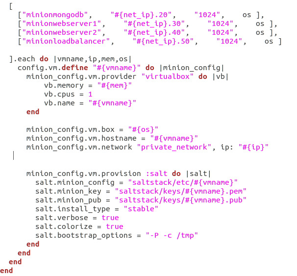

# SISTEMAS DISTRIBUIDOS -  PARCIAL 1 #


### Integrantes ###

 * Daniel Portillo - A00310452
 * Jeferson Lerma - A00301456
 * Juan Camilo Calvo - A00030140


### Tecnologias usadas para nuestro desarrollo ###

 * Vagrant
 * Sistema operativo bento/ubuntu-18.04/
 * Repositorio Github
 * SaltStack
 * NodeJs


## Objetivos ##

---

 * Realizar de forma autónoma el aprovisionamiento automático de infraestructura
 * Diagnosticar y ejecutar de forma autónoma las acciones necesarias para lograr infraestructuras estables


## Consigna del parcial: ##

---

### Aprovisionamiento del balanceador ###

**Fuente**
Referencia [Configuracion haproxy.](https://devops.ionos.com/tutorials/install-and-configure-haproxy-load-balancer-on-ubuntu-1604/)

Una vez instanciada la máquina del balanceador desde el Vagrantfile, esta se aprovisiona de la siguiente manera mediante un archivo .sls:

```
[loadbalancer.sls]
install haproxy:
  pkg.installed:
    - pkgs:
      - haproxy

/etc/haproxy/haproxy.cfg:
  file.append:
    - text: |
        
        frontend app_servers
            bind *:8080
            default_backend apps
        
        backend apps
            balance roundrobin
            server web1 192.168.130.30:8080 check
            server web2 192.168.130.40:8080 check
haproxy:
  cmd.run:
    - name: sudo systemctl restart haproxy
```

**Evidencia del Funcionamiento**

Web Server 1


Web Server 2


### Aprovisionamiento de los servidores Web ###

**Fuente:** [Tutorias vagrantfile con SaltStack minions.](https://github.com/UtahDave/salt-vagrant-demo)

Primero, empezamos instanciando los servidores en el VagrantFile:



y posteriormente hacemos su respectivo aprovisionamiento mediante un archivo .sls:

```
[Webservers.sls]
Obtener script:
  file.managed:
    - name: /home/vagrant/webserver.sh
    - source: salt://scripts/webserver.sh

correr:
  cmd.run:
    - name: sudo sh /home/vagrant/webserver.sh .


Obtener configuracion:
  file.managed:
    - name: /home/webserver/servidor.js
    - source: salt://sources/servidor.js

Obtener pagina:
  file.managed:
    - name: /home/webserver/index.html
    - source: salt://sources/index.html


correr script:
  cmd.run:
    - name: sudo nodejs /home/webserver/servidor.js
```

**Evidencia Web Server**


### Aprovisionamiento Database ###

**Fuente**
 - [Tutorial mongodb-nodejs](https://devcode.la/tutoriales/como-utilizar-mongodb-en-nodejs/)
 - [Tutorial 2 como instalar mongodb en ubuntu 18.04](https://www.digitalocean.com/community/tutorials/como-instalar-mongodb-en-ubuntu-18-04-es)
 - [Tutoria conectar mongodb y nodejs](https://unprogramador.com/como-conectar-mongodb-y-nodejs/)


Mendiante la siguiente configuracion se realizo el aprovisionamiento de la base de datos:

```
[Database.sls]
Obtener script:
  file.managed:
    - name: /home/vagrant/database.sh
    - source: salt://scripts/database.sh

correr script:
  cmd.run:
    - name: sudo chmode777 /home/vagrant/database.sh
    - name: sudo sh /home/vagrant/database.sh .

Obtener Configuracion:
  file.managed:
    - name: /etc/mongodb.conf
    - source: salt://sources/mongodb.conf

correr database:
  cmd.run:
    - name: sudo systemctl restart mongodb

Abrir puertos:
  cmd.run:
    - name: sudo iptables -A INPUT -p tcp --dport 27017 -j ACCEPT
```

### Tareas de integracion ###

Para esta tarea se decidió realizar la estrategia de branching **Trunk Base Development**, ya que esta estrategia nos permite trabajar de una manera más cómoda dada la cantidad de personas en  el grupo de trabajo (3 Personas). Además, es una estrategia de branching buena para nosotros ya que estamos iniciando a trabajar en equipo en un repositorio remoto, ya que esta cuenta como máximo con 3 ramas largas, y nos permite realizar iteraciones y pruebas en la rama master con mayot velocidad.

Para implementar esta estrategia primero se hace un fork desde uno de los repositorios de los integrantes al repositorio donde se quiere subir las evidencias del examen. Posteriormente los otros integrantes hacen un git clone el repositorio que fue forkeado; cada uno de los integrantes crea una nueva rama, donde trabaja alguna función por aparte, y posteriormente todo se mezcla en la rama master para finalmente hacer un merge.

**Evidencias:** [Github](https://github.com/JefersonLerma/sd-exam1)


### Recopilacion de Errores ###

  * No se puede conectar a la base de datos remotamente.


  * No se pudo instalar SlatStack en ubuntu 20.04 (error con los repositorios)

  * La funcion find de nodejs no funciona correctamente.


  * No se pudo aprovisionar con chef a pesar de múltiples intentos.


